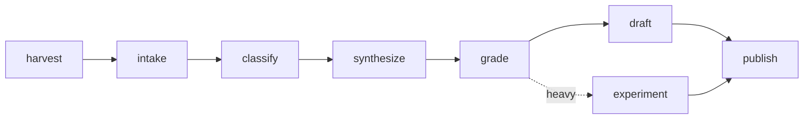
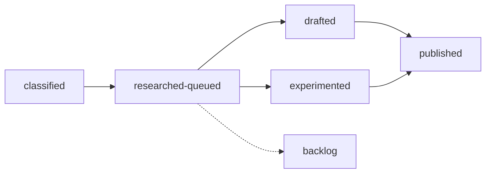

Every term used across the 8am AI corpus and pipeline, defined once. This page updates as the vocabulary grows.

---

## the substrate

**Corpus.** The full record: 109 meeting transcripts and everything derived from them. Rebuildable — delete every derived file and the pipeline reconstructs it from the transcripts.

**Meeting.** One Wednesday session. Stored as `transcripts/MM-DD-YY/`, holding the raw transcript and its derived records.

**Idea.** One distinct claim or topic mined from a meeting. Durable, identified `IDEA-NNNN`, graded, and tagged to a theme. Cites the meeting it came from.

**Theme.** A cluster of ideas the group returned to across multiple meetings. Identified `THEME-NN`. Each has a `synthesis.md` and, for the major ones, a published chapter.

**Directive.** An action item from a meeting — "I'll send X," "we should build Y." Identified `DIR-NNNN`. Triaged to open, done, or dropped.

**Mention.** A named tool, product, or entity referenced in a meeting — Claude, MCP, OpenClaw. Tracked per meeting to build the arrival and departure timeline.

---

## the records

**normalized.yaml.** The canonical shape of a meeting after intake: participants, utterances with timestamps, and 120-second windows. Downstream steps read this, never the raw transcript, so they don't branch on format.

**Utterance.** One speaker turn — who said it, when, and the text.

**Window.** A 120-second slice of the meeting with 30-second overlap. The unit the classifier reads.

**Grade.** An idea's score, 0 to 100, across six dimensions: evidence, theme strength, recency, concreteness, uniqueness, and carryover. The top 30% by grade form the queue.

---

## the pipeline

**Harvest.** Pull new transcripts from Drive and the local Fireflies archive into `transcripts/`.

**Intake.** Normalize any source format — Gemini markdown, Fireflies JSON, summary text — into `normalized.yaml`.

**Classify.** Mine each meeting for ideas, directives, and mentions.

**Synthesize.** Cluster ideas across meetings into themes. Assign each idea a track.

**Grade.** Score every idea and rank the queue.

**Draft.** Compose a chapter from the highest-signal ideas in a theme. Light track.

**Experiment.** Build a runnable artifact from a buildable idea. Heavy track.

**Publish.** Push a chapter or experiment to /8am-ai.

---

## phases and tracks

An idea moves through phases. It is never deleted.

**captured.** In a transcript, not yet extracted.
**classified.** An idea record exists, tagged to a theme.
**researched-queued.** Graded and in the working set.
**drafted.** Written into a chapter draft.
**experimented.** Built into a runnable artifact.
**published.** Live on /8am-ai.
**backlog.** Graded but below the queue cut. The reserve.

**Light track.** Idea to research to draft to published. Produces chapters.

**Heavy track.** Idea to experiment to published. Produces runnable artifacts.

---

## terms from the conversation

**Scrub.** The group's 2024 word for an agent: a basic set of instructions that makes an LLM do one job reliably. The seed of everything agentic.

**The four layers.** The project-state model that makes harvesting repeatable: agents (read across surfaces), schema (structure the records), data (the durable corpus), time (turn records into trajectory). Harvesting becomes intelligence only when all four are present.

**Project-state.** A structured substrate that gives a project memory: a corpus that is also a map, so a claim can be traced to where it came from.

**Signal harvesting.** Reading across everything that's been said to surface the connective tissue no single person can track.

**Atomic to architecture.** The shift from doing tasks to designing the systems that do tasks. The spine the corpus hangs on.

**How do you know.** The corpus's central question. Not "is the output good" — what in your process tells you it's good, independent of the thing that produced it.

**Agentic layer.** Treating after-the-fact agent work as a default property of how work gets done, not a one-off.

**Slop code.** Disposable, fast-shipped AI-generated code. Embraced in 2026 as a competitive necessity, on the condition that the control plane and documentation are kept clean.

**OpenClaw.** The autonomous-agent pattern that, in early 2026, marked the swarm inflection — directing fleets of agents instead of doing the work.

---

The index pages, state of the corpus and theme engagement over time, use these terms. The chapters put them to work.
