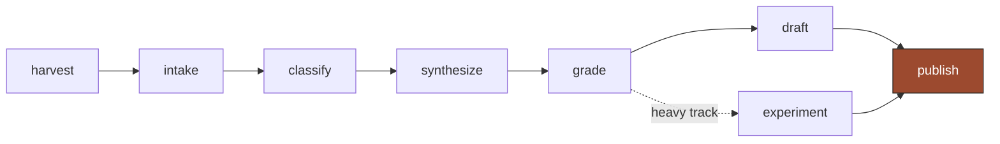

This page is a live read of the 8am AI substrate. It updates as the corpus grows. Bookmark it; the numbers move every week.

As of 2026-06-25:

- 109 meetings, 2024-04-17 to 2026-06-24
- 759 ideas mined
- 14 themes
- 401 directives
- 11 chapters and 3 experiments published to /8am-ai

---

## the pipeline

Every Wednesday's transcript runs the same path. Nothing is written into the substrate by hand.

Harvest pulls transcripts from Drive and a local Fireflies archive. Intake normalizes every format to utterances and 120-second windows. Classify mines ideas, directives, and mentions. Synthesize clusters ideas into themes. Grade scores every idea 0 to 100. The top 30% become the queue; a draft pass turns the strongest into chapters, and a heavy track turns buildable ideas into runnable experiments.

---

## 759 ideas, by phase

An idea is never deleted. It moves through phases. Backlog holds the long tail. Researched-queued is the working set — graded, ordered, waiting for a drafting pass. Published means it landed in a chapter. Experimented means it became code that runs.

The shape is deliberate. Most ideas stay in backlog. That is not waste — it is the reserve the queue draws from, ranked by grade so the next chapter always starts from the highest-signal material left.

---

## ideas per theme

Fourteen themes, ranked by how many ideas cluster into each. Agentic workflow leads at 143. The top four — agentic, context, product, developer-productivity — hold more than half the corpus. The tail themes are small but sharp: project-state substrate and llm-evaluation each under 15 ideas, and each one load-bearing.

Theme size is a proxy for attention. The group spent two years returning to agents and context without deciding to.

---

## conversation volume by quarter

Ideas mined per quarter. The dip in early 2025 is the winter break and a stretch of two-person meetings. The volume tracks attendance and intensity, not the value of any single session.

---

## what this page is

The corpus is rebuildable. Delete every derived file and the pipeline reconstructs it from the transcripts. The numbers here are not a report someone wrote. They are the current state of a system that reads its own record.

The companion page, theme engagement over time, charts how each thread rose and fell across the two years. The definitions page explains every term used here.
