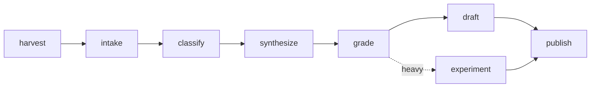

The memory is a folder of files. Something has to fill it in. That something is a set of small workers — we call them skills. Each one has a single job and does only that. No worker is clever. The cleverness is in stringing them together.

If you've ever seen an assembly line, you already understand this. A transcript comes in one end. A finished chapter comes out the other. Here are the stations, in order.

---

## the harvester: go get the meetings

The harvester's whole job is to fetch. It checks Google Drive and a local archive for new meeting recordings and copies them into the `transcripts/` folder. It keeps a bookmark of the last meeting it saw, so it never grabs the same one twice.

That's all it does. Find new transcripts, bring them home, update the bookmark.

---

## intake: make every meeting the same shape

Transcripts arrive in different formats. Some are Gemini notes, some are Fireflies recordings, some are just a summary. Intake reads whatever came in and rewrites it into one standard shape: who spoke, when, and what they said, sliced into two-minute windows.

This matters more than it sounds. Because intake makes everything look the same, every later worker can ignore where a transcript came from. They all read the same tidy format. One messy step at the front so the rest stay simple.

---

## classify: pull out the ideas

Classify reads a meeting and pulls out three things: the distinct ideas, the action items, and the tools and names that got mentioned. It writes each one as a small card.

This is the step that turns an hour of talk into a handful of labeled pieces. A meeting goes in. Ten idea-cards, a few directives, and a list of mentions come out.

---

## synthesize: find the patterns

One meeting's ideas are just a pile. Synthesize reads across all of them — all 759 — and groups the ones that belong together into themes. It's the worker that notices agents have come up 68 times, or that signal-harvesting was quiet for a year and then surged.

No single meeting shows you a pattern. Synthesize is the step that stands back far enough to see one.

---

## grade: decide what's worth writing about

Not every idea deserves a chapter. The grader scores each one from 0 to 100 — on how much evidence backs it, how strong its theme is, how recent it is, how concrete and how original. The top third become the working list. The rest wait in reserve, ranked, so the best leftover material is always next in line.

This is the worker that lets the system handle 759 ideas without drowning. It doesn't try to use everything. It puts the strongest first.

---

## draft and experiment: make something

Two ways an idea becomes a finished thing.

The draft worker takes the strongest ideas in a theme and writes a chapter — the kind of post you've been reading. The light track.

The experiment worker takes a buildable idea and builds it. The "gists as a trust substrate" idea became a small program that actually runs. The heavy track. Most ideas go light. A few are concrete enough to become code.

---

## publish: put it out

The publisher pushes a finished chapter or experiment to the blog. It's the last station. Everything upstream exists so this step has something good to ship.

---

## the orchestrator: the conductor

The orchestrator doesn't do any of the work above. It decides what runs next. It checks: any new meetings to harvest? Anything un-processed? Is it time to synthesize? What's at the top of the queue?

Then it calls the right workers in the right order and hands the result back for a look. It's the conductor — it doesn't play an instrument, it tells the players when to come in. You can run the whole week with one instruction to the orchestrator, or call any single worker on its own.

---

## the rule that keeps it honest

One more worker sits underneath all of them: the state-keeper. It is the only one allowed to write to the memory. Every other worker asks it to make a change. That single rule is why 759 ideas and 401 directives stay consistent instead of becoming a tangle of conflicting edits.

---

None of these workers is smart on its own. The harvester just fetches. The grader just scores. The value is the line they form — a meeting in one end, a published chapter out the other, and a memory that fills itself in along the way. The meeting is still where the thinking happens. The skills are what keep it from evaporating by Thursday.
