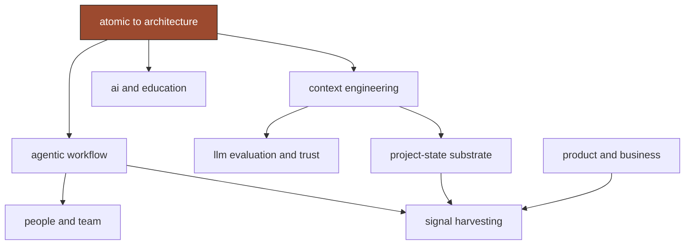

A theme is a cluster of ideas the group kept returning to. Engagement is how many ideas land in a theme in a given quarter. Plotted across two years, it shows which threads rose, which faded, and when the field turned.

This page updates as the corpus grows.

---

## the heatmap

Each cell is the number of ideas in a theme in a quarter. Darker is more.

Read the rows. Agentic workflow is warm the whole way across — the one constant. Context engineering spikes hard in 2025 Q3, the quarter the group moved from "scrubs" to corpus-building. Signal harvesting is quiet for eighteen months, then lights up in 2026 Q2 when the group turned the harvester on its own meetings. Project-state substrate doesn't appear until late 2025 and only then starts to build.

Read the columns. 2025 Q3 and 2026 Q1 are the densest — the quarters where the most threads ran hot at once.

---

## quality of intelligence

Every idea is graded 0 to 100 on evidence, theme strength, recency, concreteness, and uniqueness. Averaged per quarter, the line is a rough measure of how substantive the conversation was — how much of each session produced ideas with traceable backing rather than texture.

The grade is not a verdict on the people. It is a property of the record: a quarter with detailed, specific, well-attributed discussion scores higher than a quarter of openings and coffee. The recency term lifts recent quarters by design, because fresh ideas are cheaper to act on.

---

## arrivals and departures

The signal harvester reads mentions across all 109 meetings and reports when an entity first and last appears. Run against the corpus, it dates the field's turns without being told about them:

- MCP first appears 2025-04-23 — the orchestration era begins.
- Open Claw and OpenClaw arrive 2026-02 and 2026-03 — the autonomous-swarm inflection.
- Neuralink and Ozempic arrive 2026-05-27 — the philosophical turn.
- Claude is the one constant, present in 44 meetings from 2024-08 to 2026-06.

Two independent reads of the corpus — the hand-written chapters and this mechanical co-occurrence — agree on when things changed. That agreement is the point. The structure is in the record, not imposed on it.

---

## the theme map

Most threads are one move applied to a different surface: stop doing the unit, design the system that does the units. Agentic work applies it to who does the task. Context engineering applies it to what the model gets. Education applies it to what to teach. That move — atomic to architecture — is the spine the rest hang on.

The chapters develop each thread in full. This page is the map; the chapters are the territory.
